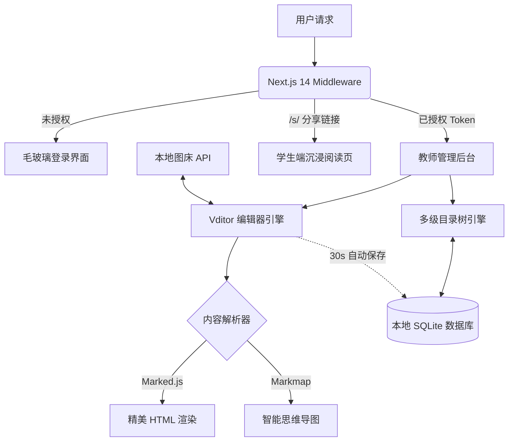

<div align="center">

# 🚀 MyNotes 

*一款专为教师与极客打造的沉浸式 Markdown 教案管理与结构化知识分发系统。*

[](https://github.com/kzhx666/mynotes/blob/main/LICENSE)
[](https://github.com/kzhx666/mynotes/stargazers)
[](https://github.com/kzhx666/mynotes/network/members)
[](https://github.com/kzhx666/mynotes)
[](https://nextjs.org/)

**简体中文** | [English](README_EN.md)

</div>

---

## 📑 目录结构

- [🚀 项目简介](#-项目简介)
- [⚡ 核心特性](#-核心特性)
- [📸 界面与演示](#-界面与演示)
- [🧠 架构设计图](#-架构设计图)
- [🌐 运行环境支持](#-运行环境支持)
- [🛠️ 极速安装指南](#-极速安装指南)
- [📂 项目源码结构](#-项目源码结构)
- [❓ 常见问题 (FAQ)](#-常见问题-faq)
- [📈 Star 历史趋势](#-star-历史趋势)

---

## 🚀 项目简介

**MyNotes** 彻底抛弃了传统的 Word 备课模式。它融合了专业的 `Vditor` Markdown 引擎与强大的 `Markmap` 思维导图解析器，支持多级文件夹嵌套、实时云端备份、防灾自动保存，并为学生端提供了具备“苹果级”毛玻璃质感的专属只读分享页面。你的每一次教学，都像是在进行一场高端的极客发布会。

---

## ⚡ 核心特性

- **✏️ 沉浸式双栏编辑**：左侧 Markdown 飞速码字，右侧实时渲染精美排版。
- **🧠 结构化思维导图**：一键将长篇教案转化为 SVG 高清思维导图，自动智能断句并解析表格。
- **🎨 专属高亮语法**：深度定制 `==高亮==` 语法，红字粉底，让教学重点在正文与导图中无处遁形。
- **🔒 私有化安全分发**：后台强制密码拦截，学生端采用高颜值 Glassmorphism (毛玻璃) UI 只读展示。
- **💾 数据极度安全**：支持 30 秒防灾自动保存、图片本地图床直传、自由上下移动排序。

---

## 📸 界面与演示

### ⚡ 核心功能演示 (Demo)
*(请在此处替换为您的实际操作 GIF 链接)*


### 💻 后台编辑与导图界面
*(请在此处替换为您的实际截图链接)*

> 全面支持多级目录树排移控制，无缝生成 SVG 思维导图。

### 🎓 学生端高端分享页
*(请在此处替换为您的实际截图链接)*


---

## 🧠 架构设计图

系统采用现代化的前后端同构框架开发，保证了极快的响应速度与 SEO 友好性。



---

## 🌐 运行环境支持

得益于容器化技术，本项目完美支持所有主流操作系统。

| 运行环境 | 版本要求 | 架构支持 | 测试状态 |
| :--- | :--- | :--- | :---: |
| **Docker** | 20.10+ | AMD64, ARM64 | 🟢 完美支持 |
| **Node.js** | 18.x, 20.x | AMD64, ARM64 | 🟢 完美支持 |
| **Linux (Debian/Ubuntu)** | 全版本 | AMD64, ARM64 | 🟢 完美支持 |
| **Windows / macOS**| 全版本 | x86_64, Apple Silicon | 🟢 完美支持 |

---

## 🛠️ 极速安装指南

强烈推荐使用 **Docker Compose** 进行一键私有化部署。

### 1. 克隆代码
```bash
git clone https://github.com/kzhx666/mynotes.git
cd mynotes
```

### 2. 配置安全密码
修改 `docker-compose.yml` 文件中的管理员密码（默认 `123456`）：
```yaml
environment:
  - ADMIN_PASSWORD=你的超级密码
```

### 3. 一键启动
```bash
docker compose up -d --build
```
> 部署完成后，在浏览器访问 `http://您的IP:3000` 即可进入系统。

---

## 📂 项目源码结构

```text
mynotes/
├── app/                 # Next.js 14 App Router 核心路由
│   ├── api/             # 后端 API 接口 ( notes / upload / login / logout )
│   ├── login/           # 管理员登录页
│   ├── s/[id]/          # 学生端只读分享页
│   └── page.tsx         # 教师后台主页
├── components/          # React 组件库
│   └── EditorContainer.tsx # 核心全能编辑器与目录树组件
├── data/                # SQLite 数据库持久化挂载目录
├── lib/                 # 核心工具库 ( db.ts 数据库实例 )
├── public/              # 静态资源与本地图床上传目录
├── middleware.ts        # 全局安全路由拦截器
├── docker-compose.yml   # 容器化编排文件
└── Dockerfile           # 镜像构建脚本
```

---

## ❓ 常见问题 (FAQ)

<details>
<summary><b>1. 忘记了管理员密码怎么办？</b></summary>

直接登录您的 VPS，修改 `/opt/mynotes/docker-compose.yml` 中的 `ADMIN_PASSWORD` 字段，然后执行 `docker compose up -d` 重启容器即可生效。
</details>

<details>
<summary><b>2. 如何备份我的教案数据？</b></summary>

教案数据全部储存在 `data/notes.db` 中，上传的图片储存在 `public/uploads/` 目录下。您只需要定期打包下载这两个文件夹即可完成全量备份。
</details>

<details>
<summary><b>3. 思维导图里的表格为什么会变成列表？</b></summary>

由于 Markmap 原生不支持 Markdown 表格语法，本项目内置了智能预处理器，会自动将表格降维转换为结构化的树状列表，确保导图在任何情况下都不会丢失数据。
</details>

---

## 📈 Star 历史趋势

感谢大家的支持，欢迎提交 PR 共同完善本项目！

[](https://star-history.com/#kzhx666/mynotes&Date)

---

<div align="center">
  <p>📝 License: <b>MIT</b> | 💡 Made with ❤️ for Education</p>
</div>
